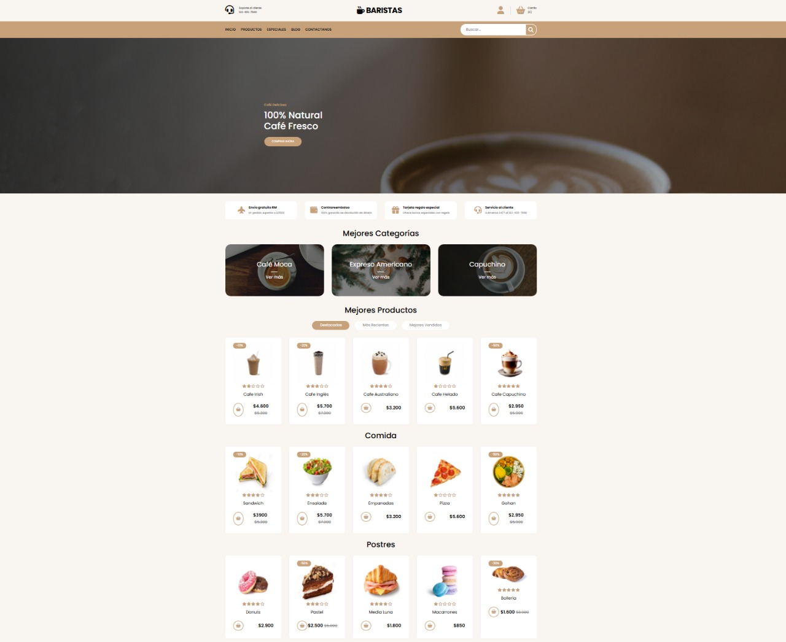
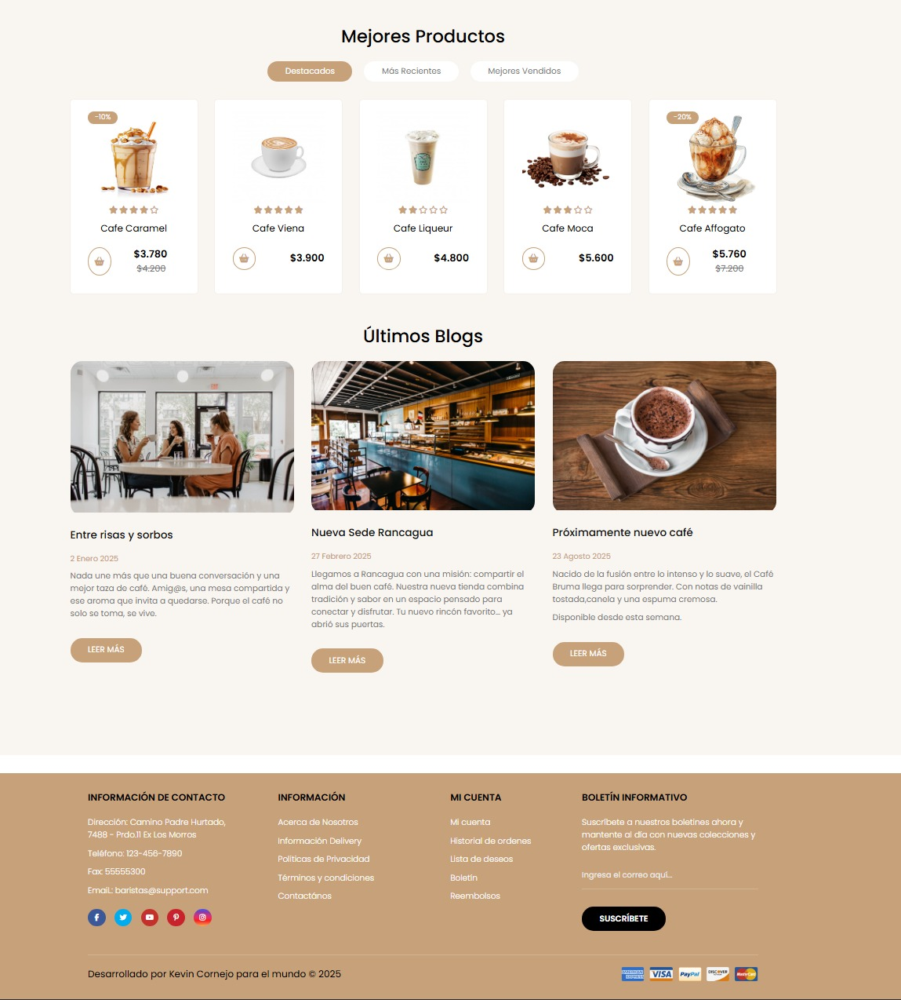

# 🌟 FoodFast - Plantilla Estática para Locales 🍽️

📢 **Bienvenido/a a FoodFast**, una plantilla web estática para restaurantes creada con **HTML, CSS y JavaScript puro**.

<p align="center">
  
  <br>
  
</p>

---

## 🚀 **Características**

✔️ Diseño responsivo y adaptable para dispositivos móviles
✔️ Animaciones suaves con CSS  
✔️ Menú de navegación interactivo  
✔️ Secciones personalizables (Inicio, Productos, Blog, Contacto)  
✔️ FAQ interactivo con JavaScript
✔️ Carrito de compras
✔️ Pagina de pagos

---

## 📂 **Estructura del Proyecto**

```bash
📦 foodfast/
 ┣ 📂 img/            # Recursos de imágenes
 ┣ 📂 css/            # Estilos CSS
 ┣ 📂 js/             # Scripts JavaScript
 ┣ 📜 index.html      # Página principal
```

🛠 Tecnologías Utilizadas

- HTML5
- CSS3 Moderno (Flexbox y Grid, Anidamiento, Variables)
- JavaScript
- FontAwesome
- Google Fonts
- Fontawesome
